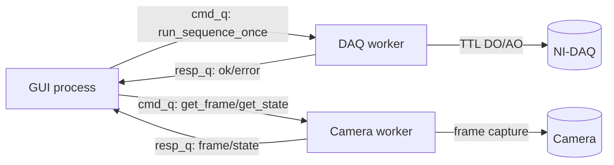
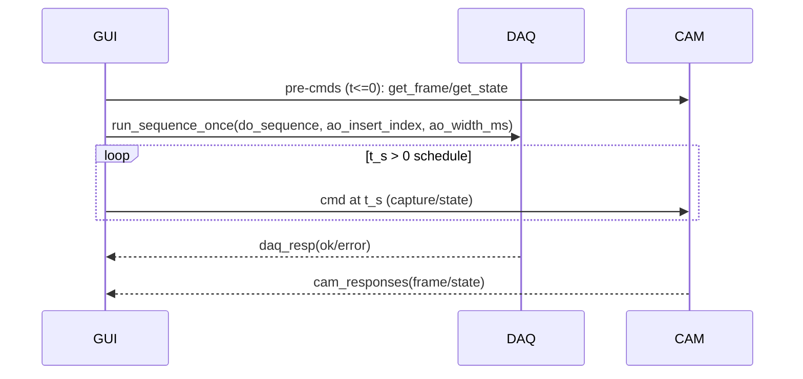
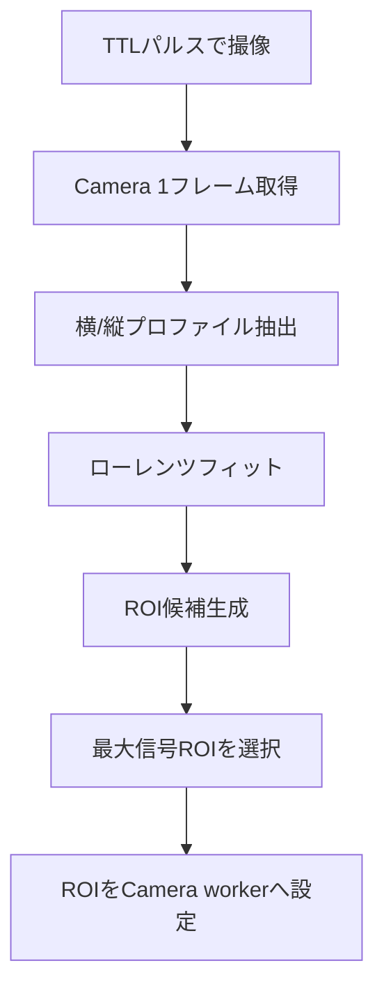
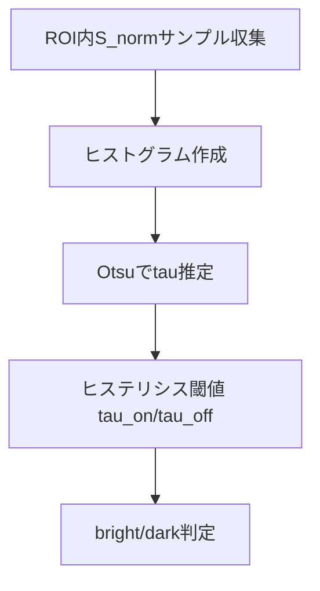
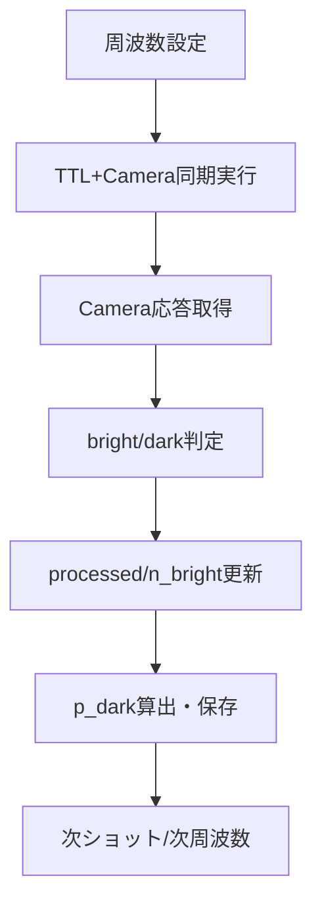

# Shutter/Camera 制御プログラム（内部構造中心の説明）

本章は GUI の外観説明を最小限に抑え、**シーケンス制御・画像処理・スペクトル取得**の内部構造を中心に記述する。最終成果物であるスペクトルは **励起確率 p_dark** をプロットする設計である。

---

## 1. 全体アーキテクチャ（内部構造）

本システムは **GUI／DAQ／Camera** をプロセス分離し、キュー通信で同期する。DAQ と Camera を独立プロセスにすることで、**フレーム取得と TTL パルスのタイミングジッタを低減**し、測定の再現性を高める。

**主な責務**
- GUI: 設定入力とワークフロー制御
- DAQ worker: TTL シーケンス実行（DO/AO）
- Camera worker: フレーム取得と bright/dark 判定

**関連実装**
- GUI: `src/shutter_camera_trigger/shutter_gui.py`
- DAQ worker: `src/shutter_camera_trigger/daq_worker_mpq.py`
- Camera worker: `src/camera/ion_state_worker.py`
- タイミング同期: `src/shutter_camera_trigger/sequence/timing.py`

**図1: プロセス構成と通信（概略）**  
GUI が DAQ/Camera の各 worker にコマンドを送り、レスポンスを受け取る非同期構造。DAQ は TTL シーケンスを実行し、Camera はフレーム取得と bright/dark 判定を返す。


---

## 2. シーケンス制御（TTL + AO とカメラ同期）

### 2.1 DO ビット割り当て
- bit0: 397
- bit1: 397 SIG
- bit2: Camera Trigger
- bit3: 854

**TTL シーケンスの構造**
```
[(do_value_0, hold_s_0), (do_value_1, hold_s_1), ...]
```

**AO パルス挿入**
- `ao_insert_index` で DO シーケンス内の挿入位置を指定
- `ao_width_ms` で AO パルス幅を指定

関連実装:
- `src/shutter_camera_trigger/sequence/spec.py`
- `src/shutter_camera_trigger/sequence/timing.py`

### 2.2 AO/TTL とカメラを同時に動かす仕組み
カメラは「いつフレーム取得/状態取得を行うか」を **時刻 t_s 付きのスケジュール**として受け取る。`run_timed_sequence` は以下の要領で DAQ とカメラを同期させる。

**要点**
- `camera_commands` から **時刻付きコマンド列**を作成
- t_s <= 0 のコマンドは **DAQ 開始前に先行送信**
- DAQ に `run_sequence_once` を投入し、同時に t_s > 0 のコマンドを **時刻で送信**
- すべてのレスポンスを集めた時点で完了

**図2: 同期実行の概念フロー**  
カメラは時刻指定のコマンド列を受け取り、DAQ の TTL 実行と同時にフレーム取得を行う。t_s<=0 は事前送信、t_s>0 はタイミング送信。


**疑似コード（実際の意味に沿った説明）**
```text
camera_schedule = build_camera_schedule(camera_commands)
pre_cmds  = [cmd | cmd.t_s <= 0]
post_cmds = [cmd | cmd.t_s > 0]

send(pre_cmds)                         # 事前カメラ取得
start_time = now()
DAQ.run_sequence_once(do_sequence)     # TTL/AO 実行

while not (DAQ_resp received and all CAM_responses received):
  if now()-start_time >= next post_cmd time:
    send(next post_cmd)                # t_s 到達で送信
  poll DAQ_resp and CAM_resp
  if timeout: error
```

---

## 3. ROI 検出（画像処理の入口）

### 3.1 ROI の自動推定
ROI は単発フレームから推定し、**最も信号の強い領域**を選択する。`analysis_profiles.py` では画像プロファイルにローレンツ関数を当て、ピーク中心と幅から ROI を推定する。

ローレンツ関数:
```
I(x) = A * wid^2 / ((x - x0)^2 + wid^2) + offset
FWHM = 2 * wid
```

関連実装:
- ROI推定: `src/shutter_camera_trigger/sweep/stages_roi.py`
- プロファイル解析: `src/camera/lib/analysis_profiles.py`

**図3: ROI 推定フロー**  
TTL で 1フレーム取得し、プロファイル解析から ROI 候補を抽出、最も信号が強い領域を ROI として確定する。


**疑似コード（意味ベース）**
```text
frame = acquire_frame_with_ttl()
roi_candidates = estimate_roi_candidates(frame)   # プロファイルから候補生成
roi = select_max_signal_roi(frame, roi_candidates)
store roi into session
camera_worker.set_roi(roi)                        # 以後の判定をROIで実施
```

---

## 4. 閾値推定（bright/dark 分類の妥当化）

### 4.1 ROI 正規化強度
ROI 内のフォトン数を露光時間で正規化し、明暗判定指標とする:
```
S_norm = (sum(ROI) - mean(bg_roi) * Npx) / exposure_s
```

実装:
- `src/camera/lib/thresholding.py` の `normalize_count`

### 4.2 Otsu 分割の説明
Otsu 法は **ヒストグラムを 2 クラスに分割**し、クラス間分散が最大となる閾値 `tau` を選ぶ手法である。画素値（または ROI 正規化強度）の分布が二峰性のとき、有効な分離が得られる。

離散ヒストグラム `p(i)` に対し、
- クラス確率 `ω0(t), ω1(t)`
- クラス平均 `μ0(t), μ1(t)`
- 全体平均 `μT`

を定義し、**クラス間分散**を
```
σ_B^2(t) = ω0(t) * ω1(t) * (μ0(t) - μ1(t))^2
```
とする。この `σ_B^2(t)` を最大化する `t` が Otsu 閾値 `tau` となる。

実装:
- `src/camera/lib/thresholding.py` の `otsu_from_array`
- `quick_threshold_from_samples` で Otsu をベースに `tau` を決定

### 4.3 ヒステリシス判定
閾値近傍のゆらぎで状態が頻繁に切り替わらないよう、ヒステリシスを導入する。
```
bright if S_norm > tau_on
dark   if S_norm < tau_off
```

実装:
- `src/camera/lib/thresholding.py` の `classify_hysteresis`
- UI側の検証と可視化: `src/shutter_camera_trigger/sweep/stages_threshold.py`

**図4: 閾値推定と判定の流れ**  
ROI 内の S_norm 分布から Otsu により tau を推定し、ヒステリシス閾値で bright/dark を安定化判定する。


---

## 5. スペクトル取得（最終成果）

周波数掃引ごとに複数ショットを取得し、**励起確率 p_dark** を推定する。

### 5.1 1点あたりの統計
```
p_dark = 1 - (n_bright / n_processed)
```

### 5.2 スペクトル出力
- `shots.csv`: 各ショットの判定とメタ情報
- `spectrum.csv`: 各周波数の `p_dark`

実装:
- `src/shutter_camera_trigger/sweep/spectrum_stage.py`
- `src/shutter_camera_trigger/sweep/spectrum_ui.py`

**図5: スペクトル取得ループ**  
周波数ごとに複数ショットを実行し、p_dark を算出してスペクトル点を更新する。


**疑似コード（意味ベース）**
```text
for freq in freqs:
  set_frequency(freq)
  processed = 0
  n_bright = 0
  repeat until processed == n_target or attempts == max_attempt:
    run_timed_sequence()              # TTL/AO とカメラを同時実行
    if camera_resp is valid:
      processed += 1
      n_bright += is_bright(camera_resp)
  p_dark = 1 - n_bright / processed
  append to spectrum.csv
```

---

## 6. 妥当性・動作保証の設計

1. **段階的ワークフロー**
   - ROI check → Threshold → Spectrum
   - 前段が成功しない限り次段に進めない（誤った判定や雑音の混入を防止）

2. **タイムアウトと再試行**
   - フレーム取得は `max_attempt` まで再試行
   - `run_timed_sequence` で全体タイムアウトを制御

3. **ログと出力**
   - `shots.csv`, `spectrum.csv`, `threshold.json`, `manifest.json`
   - 再現性と検証性を担保

---

## 7. 最小限の GUI 説明

GUI は内部処理の入口としてのみ扱い、説明は最小限に留める。
- ROI check / Threshold / Spectrum の三段階ボタンが内部フローを駆動
- 本質的な処理は `sweep/workflow.py` に集約

---

## 参考コード抜粋（本文に掲載候補）

### スペクトルの確率定義（p_dark）
`src/shutter_camera_trigger/sweep/spectrum_stage.py`
```python
p_dark = (1.0 - (n_bright / processed)) if processed > 0 else 0.0
```

### 正規化強度 S_norm
`src/camera/lib/thresholding.py`
```python
S_norm = (sum(ROI) - mean(bg_roi) * Npx) / exposure_s
```

---

## 図表候補（卒論用）

1. 図1: プロセス構成と通信
2. 図2: AO/TTL とカメラ同期のタイムライン
3. 図3: ROI 推定フロー
4. 図4: 閾値推定とヒステリシス判定
5. 図5: スペクトル取得ループ
